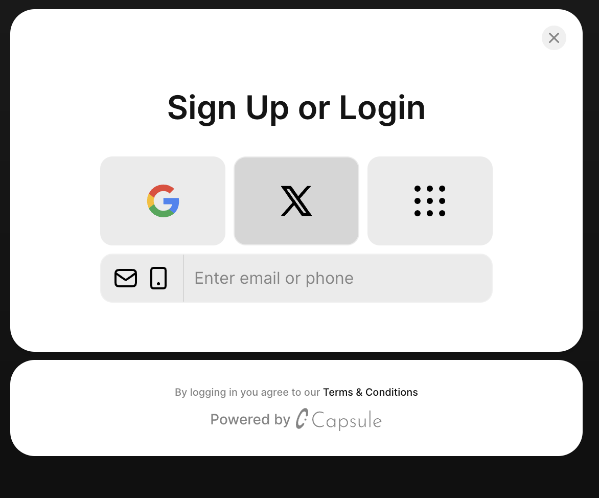
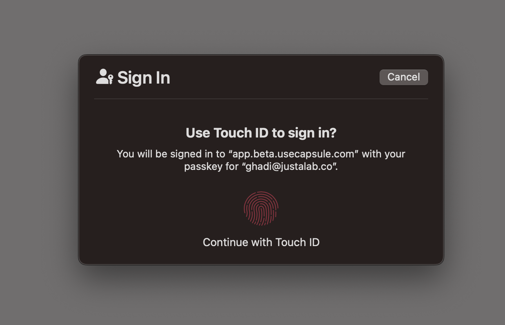
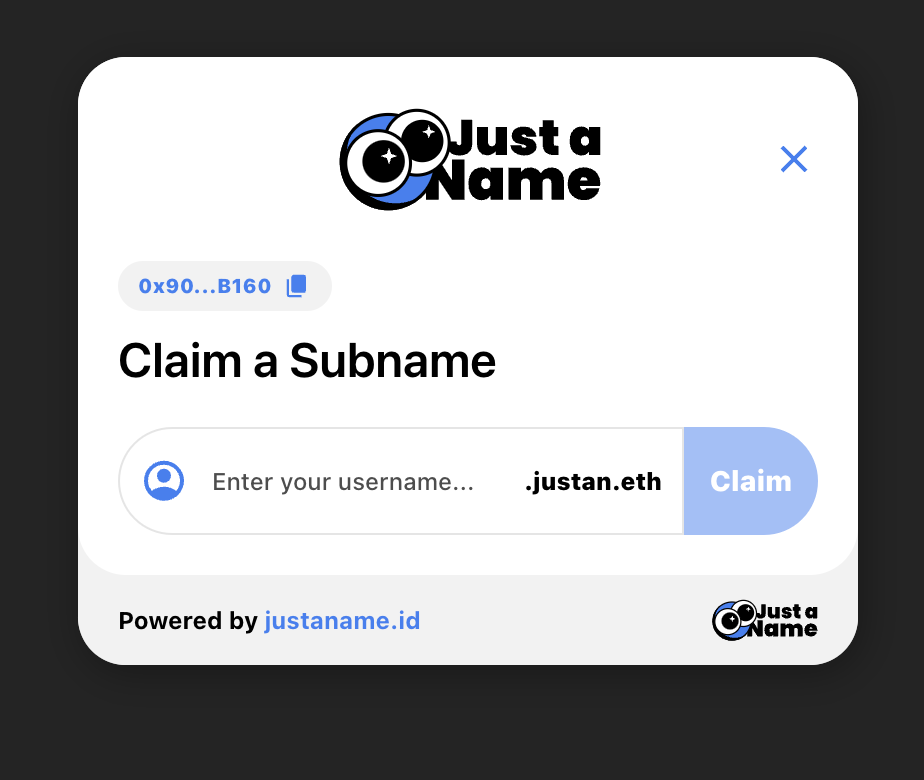
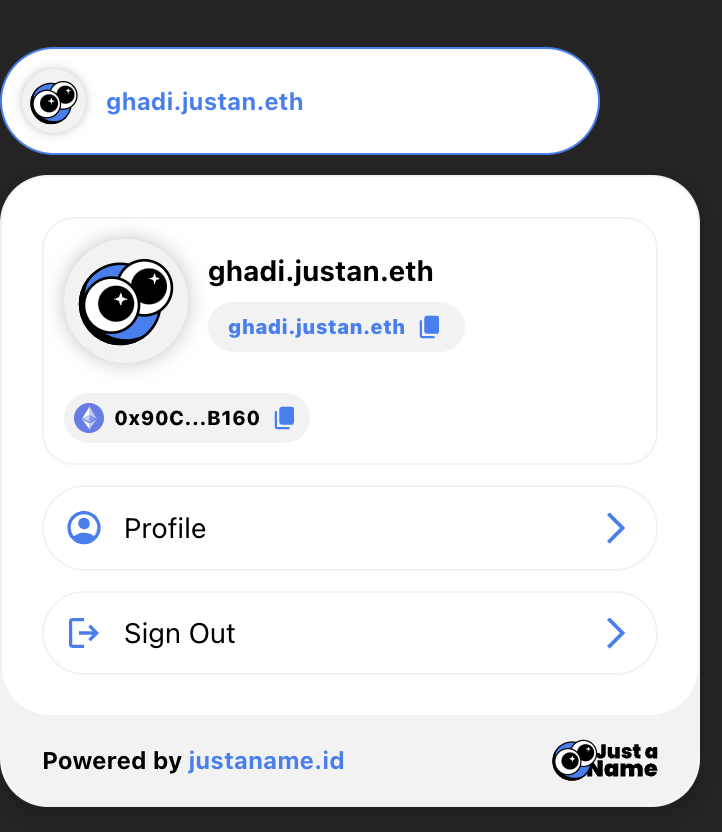
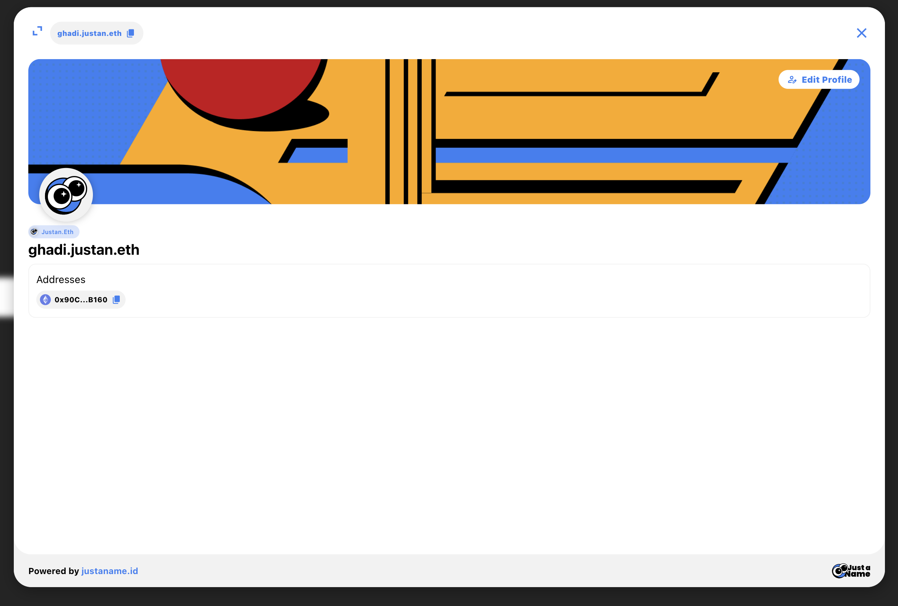

# Example Repository: Capsule 🤝 JustaName Integration

This repository provides an example integration of two powerful tools:

- **Capsule**: An embedded wallet solution that enables cross-app experiences.
- **JustaName**: An identity layer that offers ENS subname issuance as an out-of-the-box solution for dApps.

By combining these two solutions, developers can unlock a complete user experience, where users can easily onboard, manage their wallets, and claim ENS subnames, all within the same interface.

---

## Possibilities of Integration

1. **Streamlined Onboarding**

   - Users can log in effortlessly using Capsule's intuitive interface, as seen in the screenshots.
   - Multiple authentication options, including Google, Twitter (X), email, phone, and biometrics like Touch ID.

2. **Identity and Wallet Management**

   - Once logged in, users can manage their identity through JustaName, enabling ENS subname issuance within seconds.
   - The integration ensures users can claim and personalize their subnames, making their digital identity portable across apps.

3. **Enhanced User Engagement**

   - With Capsule managing the wallet and JustaName handling identities, dApps can focus on their core functionality while offering a cohesive experience.

4. **Customization for dApps**

   - Both Capsule and JustaName offer customizable widgets that blend with any app’s design and branding.
   - Developers can configure the color schemes, backend URLs, and allowed domains to match their application needs.

5. **Cross-App Utility**
   - With Capsule’s cross-app wallet solution and JustaName’s identity layer, users can carry their wallet and ENS identity across different dApps without re-onboarding.

---

## Screenshots

### Capsule Authentication Flow

1. **Sign Up or Login**

   - Capsule provides a clean, modern login interface with multiple options for authentication, such as OAuth, email, or phone.
     

2. **Biometric Authentication**
   - Users can authenticate using biometrics like Touch ID for added security and convenience.
     

### JustaName Integration

3. **Claim a Subname**

   - JustaName’s widget enables users to easily claim a personalized ENS subname, making identity creation straightforward.
     

4. **Profile Management**

   - Users can view and manage their profiles, including their ENS subname and linked wallet addresses, all powered by JustaName.
     

5. **Detailed Profile View**
   - A detailed user profile screen showcases the user’s ENS subname, wallet addresses, and customizable avatar or background.
     

---

## Features

1. **Capsule Integration**:

   - Embedded wallet for seamless user onboarding.
   - Support for OAuth methods, email, and phone logins.
   - Biometric authentication for enhanced security.

2. **JustaName Integration**:
   - Issue ENS subnames directly from your dApp.
   - Fully customizable configuration for ENS domains and UI.
   - Profile management tools for enhanced user control.

---

## Documentation

For more information, visit the official documentation:

- [JustaName Documentation](https://docs.justaname.id/)
- [Capsule Documentation](https://docs.usecapsule.com)

---

## API Keys

- To get a JustaName API Key, head over to the [dashboard](https://dashboard.justaname.id)
- To get a Capsule API Key, head over to the [dashboard](https://developer.usecapsule.com)

## License

This example repository is open-source and available under the MIT License.
